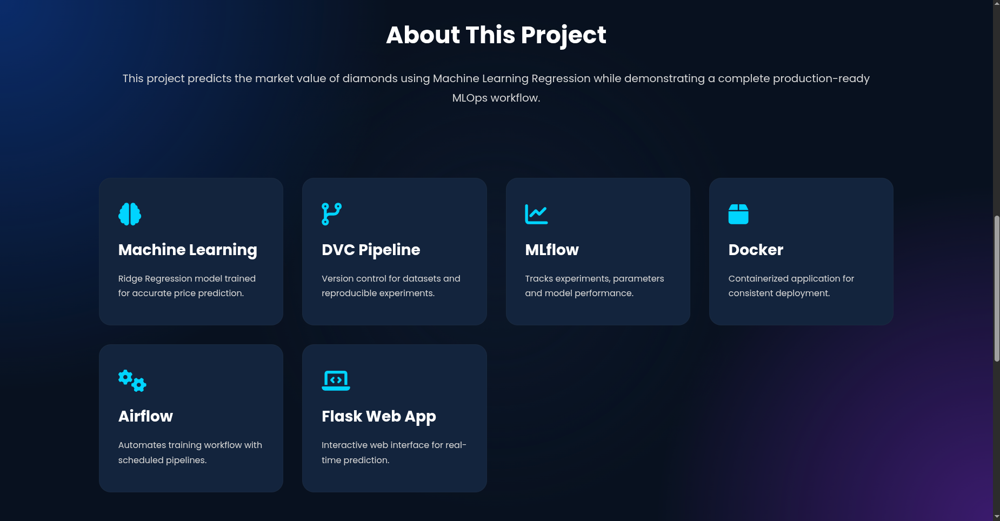
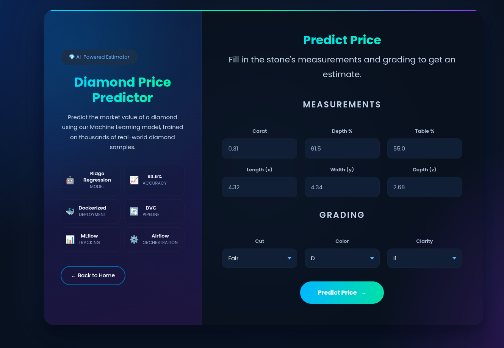
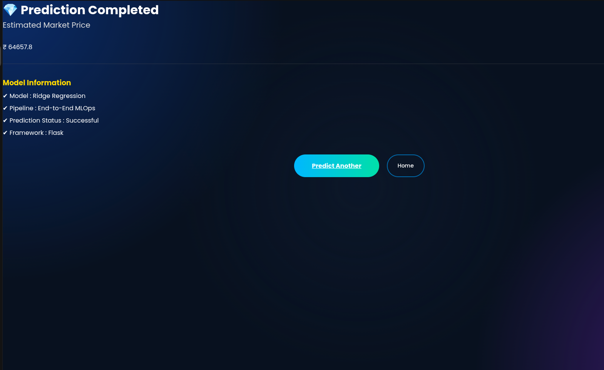
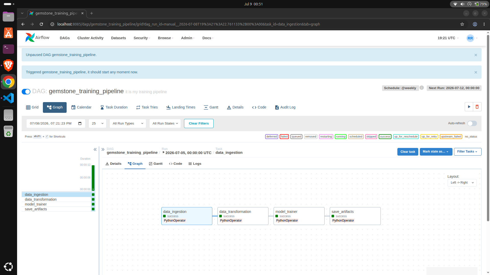
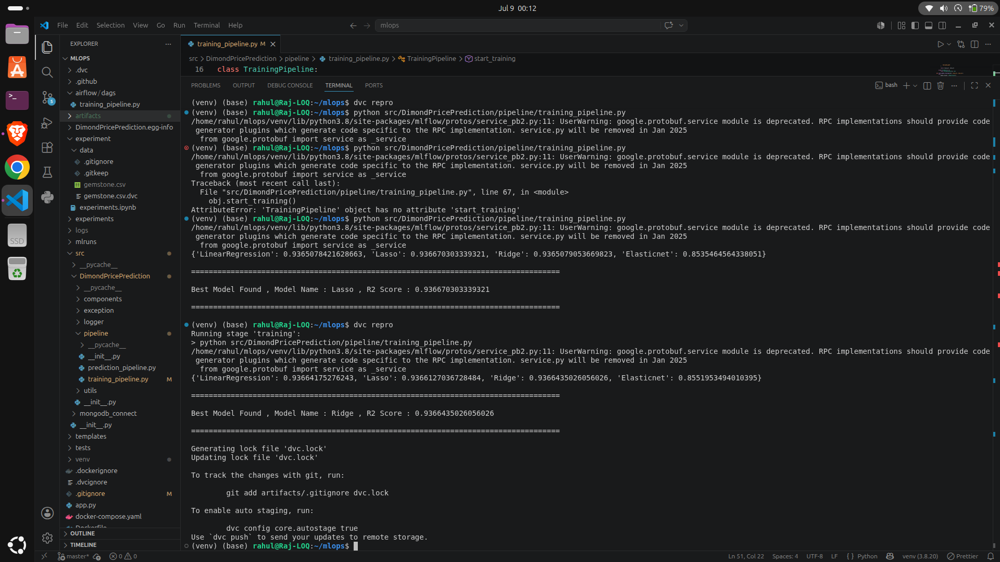

# 💎 End-to-End Diamond Price Prediction MLOps Pipeline

<p align="center">
An end-to-end <b>Machine Learning Operations (MLOps)</b> project that predicts diamond prices using a production-ready machine learning pipeline. This project demonstrates the complete ML lifecycle—from data versioning and model training to workflow orchestration and cloud deployment using modern MLOps tools.
</p>

<p align="center">


</p>

---

# 🚀 Live Demo

🌐 **Web Application**

https://diamond-price-app-latest.onrender.com/

📂 **GitHub Repository**

https://github.com/shadesof-black/End-to-End_Mlops_pipeline

---

# 📚 Table of Contents

- Project Overview
- Tech Stack
- Project Structure
- Pipeline Architecture
- Workflow
- Screenshots
- Features
- Run Locally
- Docker
- Future Improvements
- Author

---

# 📌 Project Overview

This project automates the complete machine learning workflow for predicting diamond prices using modern MLOps practices.

The pipeline includes:

- ✅ Data Ingestion
- ✅ Data Validation
- ✅ Data Transformation
- ✅ Feature Engineering
- ✅ Model Training
- ✅ Model Evaluation
- ✅ Best Model Selection
- ✅ Data Version Control (DVC)
- ✅ Experiment Tracking (MLflow)
- ✅ Workflow Automation (Apache Airflow)
- ✅ Flask Web Application
- ✅ Docker Containerization
- ✅ Cloud Deployment

---

# 🛠 Tech Stack

## Machine Learning

- Python
- Scikit-Learn
- XGBoost
- CatBoost
- LightGBM
- Pandas
- NumPy

## MLOps

- Apache Airflow
- DVC
- MLflow
- Docker

## Backend

- Flask

## Deployment

- Render

## Version Control

- Git
- GitHub

---

# 📂 Project Structure

```text
End-to-End_Mlops_pipeline
│
├── airflow/
├── artifacts/
├── src/
├── templates/
├── static/
├── app.py
├── Dockerfile
├── docker-compose.yaml
├── dvc.yaml
├── requirements.txt
└── README.md
```

---

# 🔄 Pipeline Architecture

```text
                Raw Dataset
                     │
                     ▼
             Data Ingestion
                     │
                     ▼
            Data Validation
                     │
                     ▼
         Data Transformation
                     │
                     ▼
        Feature Engineering
                     │
                     ▼
      Multiple Model Training
                     │
                     ▼
      Best Model Selection
                     │
                     ▼
        MLflow Experiment Tracking
                     │
                     ▼
         Model Serialization
                     │
                     ▼
         Flask Prediction API
                     │
                     ▼
          Cloud Deployment
```

---

# ⚙ Workflow

## 📥 Data Ingestion

- Loads the raw dataset
- Splits data into training and testing datasets
- Stores processed data as artifacts

---

## 🔄 Data Transformation

- Handles missing values
- Encodes categorical features
- Scales numerical features
- Performs feature engineering

---

## 🤖 Model Training

Multiple regression algorithms are trained and compared:

- Linear Regression
- Decision Tree
- Random Forest
- XGBoost
- CatBoost
- LightGBM

The best-performing model is automatically selected and saved.

---

## 📊 MLflow Experiment Tracking

MLflow is used to track:

- Model parameters
- Performance metrics
- Training history
- Model artifacts

---

## 📦 Data Version Control (DVC)

DVC is used for:

- Dataset versioning
- Pipeline versioning
- Artifact management
- Reproducible ML experiments

---

## ⚙ Apache Airflow

Apache Airflow automates the complete ML pipeline by orchestrating:

- Data Ingestion
- Data Transformation
- Model Training
- Model Evaluation

---

## 🌐 Model Deployment

The trained model is deployed using Flask.

Users can:

- Enter diamond specifications
- Predict the estimated price
- Access the application through a responsive web interface

---

# 📸 Project Screenshots

## 🏠 Home Page



---

## 📋 Prediction Form



---

## 💰 Prediction Result



---

## ✅ Airflow Successful Pipeline



---

## 🏆 Best Model Selection



---

# ✨ Features

- End-to-End Machine Learning Pipeline
- Automated Data Processing
- Modular Code Structure
- Automatic Best Model Selection
- Apache Airflow Workflow Automation
- MLflow Experiment Tracking
- DVC Data Versioning
- Flask Prediction API
- Responsive User Interface
- Docker Support
- Cloud Deployment
- Production-ready Architecture

---

# ▶️ Run Locally

Clone the repository

```bash
git clone https://github.com/shadesof-black/End-to-End_Mlops_pipeline.git
```

Move into the project

```bash
cd End-to-End_Mlops_pipeline
```

Create a virtual environment

```bash
python -m venv venv
```

Activate the virtual environment

### Linux/macOS

```bash
source venv/bin/activate
```

### Windows

```bash
venv\Scripts\activate
```

Install dependencies

```bash
pip install -r requirements.txt
```

Run the application

```bash
python app.py
```

Open your browser and visit:

```text
http://localhost:8000
```

---

# 🐳 Docker

Build the Docker image

```bash
docker build -t diamond-price-app .
```

Run the container

```bash
docker run -p 8000:8000 diamond-price-app
```

---

# 🚀 Deployment

The application is deployed on **Render**.

### Live Demo

https://diamond-price-app-latest.onrender.com/

---

# 🎯 Future Improvements

- CI/CD using GitHub Actions
- Kubernetes Deployment
- AWS Deployment
- Model Monitoring
- Data Drift Detection
- Automated Model Retraining
- REST API Documentation

---

# 👨‍💻 Author

## Rahul Raj


GitHub: https://github.com/shadesof-black

---

# ⭐ Support

If you found this project useful, please consider giving it a ⭐ on GitHub. It helps others discover the project and supports future improvements.